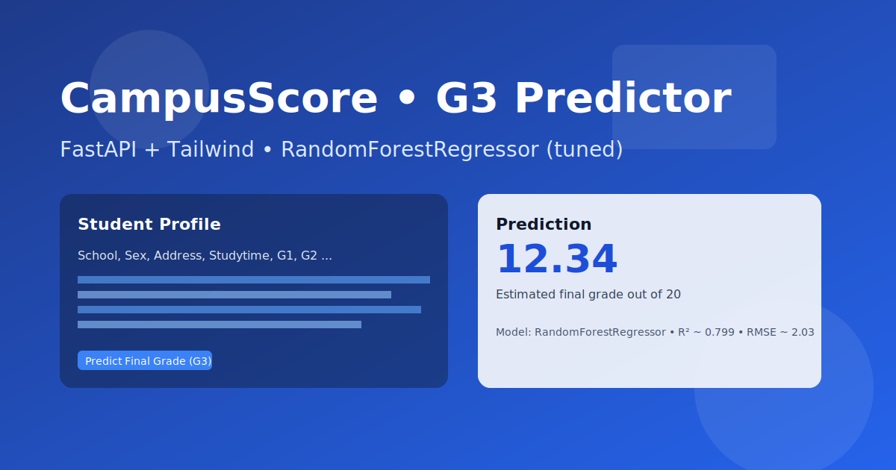

# Student Exam Performance Prediction

Bu proje, ogrenciye ait sosyo-demografik bilgiler ve onceki notlara dayanarak G3 (final notu) tahmini yapan uctan uca bir makine ogrenmesi uygulamasidir.

## Amac

Regresyon ile G3 tahmini: veri on isleme, ozellik muhendisligi, model egitimi/degerlendirmesi ve modern bir web arayuzu ile sunum.

## Veri

- Demografik: cinsiyet, yas, adres, aile durumu vb.
- Akademik: G1, G2, aktiviteler, calisma suresi vb.
- Hedef: G3 (final notu)

## Modeller

- Linear Regression, Ridge, Lasso, KNN
- Decision Tree, Random Forest, (ops.) XGBoost, CatBoost, AdaBoost

## En Basarili Model

```
RandomForestRegressor (tuned)
Test R2: ~0.799
Test RMSE: ~2.03
```

## Web Uygulamasi (FastAPI)

Form uzerinden girilen ogrenci bilgileri ile G3 tahmini yapar. Uygulama FastAPI + Uvicorn ile calisir; arayuz Tailwind tabanlidir.

### Teknolojiler

- Python
- FastAPI, Uvicorn
- Scikit-learn (ops.: XGBoost, CatBoost)
- Tailwind CSS (CDN)
- Logging, Exception Handling
- Pipeline & Model Persistency (dill)

## Uygulama Goruntusu



Not: Kendi ekran goruntunuzu `static/app_screenshot.png` olarak kaydedip README'de bu dosyayi referans verebilirsiniz.

## Nasil Calisir?

1. Formdan veriyi alir.
2. Preprocessor ile donusturur (ColumnTransformer + OneHot/Scale).
3. Egitilmis modelle tahmin yapar.
4. Sonucu arayuzde gosterir.

## Kurulum

```bash
git clone https://github.com/Kubilayalici/end_to_end_mlproject.git
cd end_to_end_mlproject
pip install -r requirements.txt
python -m uvicorn app:app --reload
```

## Calistirma (Run)

- Gelistirme: `python -m uvicorn app:app --reload`
- Docker (yerel): `docker compose up --build`

## Gelistirici

**Kubilay ALICI**  
[GitHub](https://github.com/Kubilayalici) | [LinkedIn](https://www.linkedin.com/in/kubilay-alici-8822a21b9/)

---

Bu proje, veri bilimi yeteneklerinizi sergilemek ve model gelistirme sureclerini uctan uca anlamak icin guclu bir ornektir.

